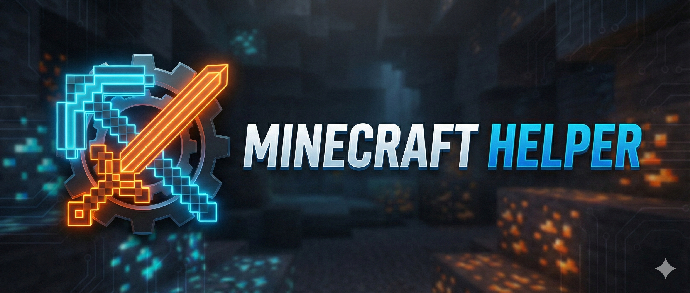
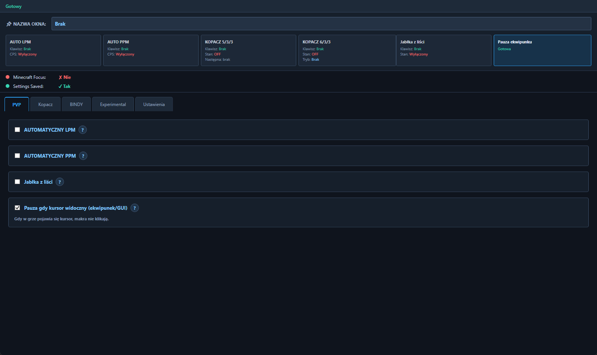
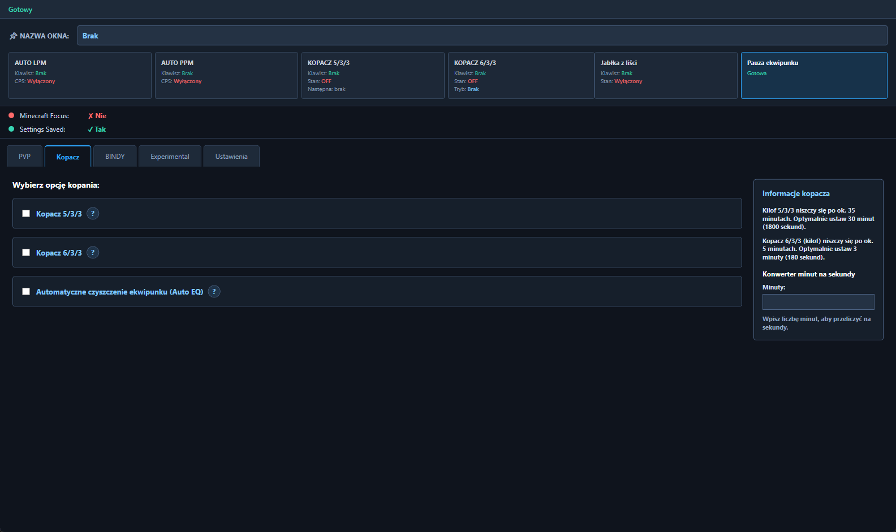
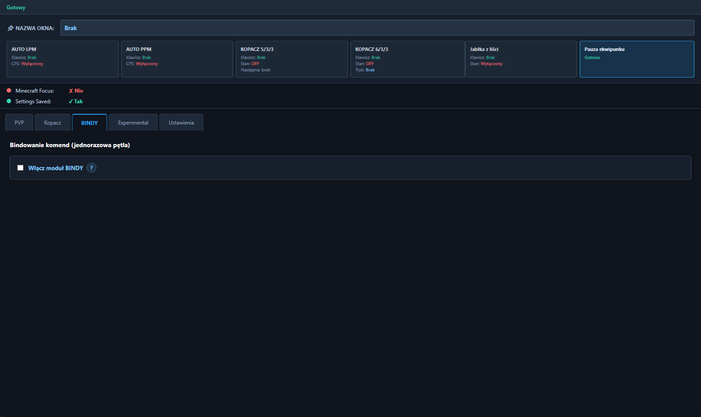
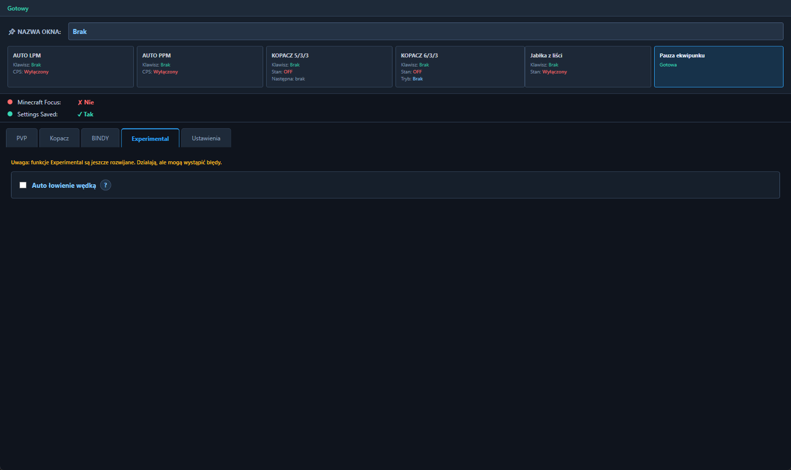
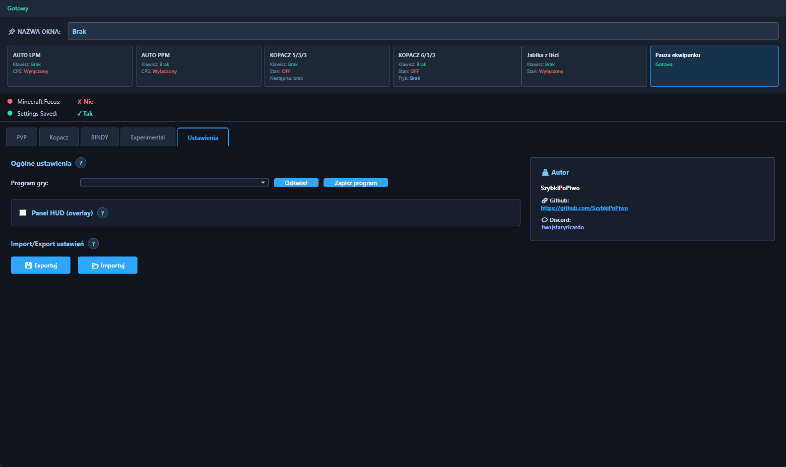

<p align="center">
  
</p>

<h1 align="center">Minecraft Helper</h1>

<p align="center">
  Clickery, automatyczne kopanie, Auto EQ, CobbleX, bindy i HUD dla Minecraft 1.8.8.
</p>

<p align="center">
  <strong>Windows 10/11</strong> · <strong>Minecraft 1.8.8</strong> · <strong>bez Forge i modów</strong> · <strong>wersja 1.1.1</strong>
</p>

<p align="center">
  <a href="#szybki-start">Szybki start</a> ·
  <a href="#pvp">PVP</a> ·
  <a href="#kopacz-auto-eq-i-cobblex">Kopacz</a> ·
  <a href="#bindy">BINDY</a> ·
  <a href="#experimental">Experimental</a> ·
  <a href="#ustawienia-i-hud">Ustawienia</a> ·
  <a href="#instalacja">Instalacja</a> ·
  <a href="#to-do">TO DO</a>
</p>

Minecraft Helper to aplikacja dla Windows wspomagająca grę w Minecraft 1.8.8. Pozwala uruchamiać clickery, automatyzować kopanie, wykonywać komendy pod własnymi bindami oraz porządkować ekwipunek przy użyciu przygotowanej paczki zasobów. Program nie wymaga Forge ani instalowania moda w grze.

> Program wysyła wejście z klawiatury i myszy do wybranego okna gry. Przed uruchomieniem funkcji upewnij się, że wskazany jest właściwy proces Minecrafta, a okno gry ma fokus.

## Szybki start

Jeżeli korzystasz z programu pierwszy raz:

1. [Zainstaluj aplikację](#instalacja) albo [uruchom ją ze źródeł](docs/BUILDING.md).
2. Uruchom Minecraft lub BlazingPack w wersji 1.8.8 i wejdź do gry.
3. W Minecraft Helper otwórz zakładkę `Ustawienia`.
4. Kliknij `Odśwież`, wybierz właściwy proces gry i kliknij `Zapisz program`. Nie wybieraj launchera.
5. Otwórz interesującą Cię zakładkę, zaznacz moduł i skonfiguruj jego ustawienia.
6. Ustaw bind, zapisz ustawienia i przejdź do Minecrafta.

Zaznaczenie głównego pola modułu rozwija jego konfigurację. Samo zaznaczenie nie zawsze uruchamia funkcję — clickery, Kopacz i pozostałe moduły włącza się ustawionym bindem. Szczegółowe podpowiedzi są dostępne pod przyciskami `?`.

Przy pierwszym uruchomieniu pojawi się okno powitalne. Po aktualizacji programu to samo okno pokaże listę zmian i ostrzeże o ewentualnej różnicy wersji zapisanych ustawień.

## Przegląd funkcji

| Zakładka | Do czego służy |
| --- | --- |
| `PVP` | Automatyczne klikanie LPM i PPM, obsługa bindów oraz pauza po otwarciu GUI. |
| `Kopacz` | Automatyczne kopanie, harmonogram komend, czyszczenie ekwipunku i tworzenie CobbleX. |
| `BINDY` | Własne skróty, które wpisują i wysyłają przygotowane komendy na czacie. |
| `Experimental` | Funkcje testowe, obecnie automatyczne łowienie. |
| `Ustawienia` | Wybór procesu Minecrafta, konfiguracja HUD, import i eksport ustawień oraz działanie aplikacji w tle. |

## PVP

<p align="center">
  <a href="docs/images/app-pvp.png">
    
  </a><br>
  <sub>Kliknij obraz, aby otworzyć go w pełnym rozmiarze.</sub>
</p>

W tej zakładce znajdują się funkcje związane z klikaniem oraz ich zabezpieczenie przed działaniem w otwartym ekwipunku.

### AUTO LPM i AUTO PPM

- `AUTO LPM` automatycznie wykonuje lewe kliknięcia.
- `AUTO PPM` automatycznie wykonuje prawe kliknięcia.
- `AUTO PPM` i `HOLD PPM` nie uruchomią się, gdy Minecraft pokazuje kursor ekwipunku, chatu albo innego GUI. Bind zostanie zignorowany i pojawi się ostrzeżenie.
- Zakres minimalnego i maksymalnego CPS określa szybkość klikania.
- W trybie klasycznym ustawiony bind włącza clicker, a kolejne naciśnięcie go wyłącza.
- Tryb combo pozwala osobno ustawić przycisk rozpoczynający i zatrzymujący działanie.
- Opcjonalny tryb `DAB (O)` przytrzymuje klawisz `O` podczas działania AUTO LPM.

Najpierw zaznacz wybrany moduł, rozwiń ustawienia, przypisz bind i zapisz konfigurację. Clicker działa tylko wtedy, gdy zapisane okno Minecrafta ma fokus.

### Pozostałe opcje

- `Jabłka z liści` wykonują przygotowany cykl z wybranym bindem i komendą.
- `Pauza gdy kursor widoczny (ekwipunek/GUI)` zatrzymuje klikanie, kiedy gra pokazuje kursor. Zalecamy pozostawić tę opcję włączoną.

## Kopacz, Auto EQ i CobbleX

<p align="center">
  <a href="docs/images/app-kopacz.png">
    
  </a><br>
  <sub>Kliknij obraz, aby otworzyć go w pełnym rozmiarze.</sub>
</p>

Zakładka `Kopacz` łączy automatyczne kopanie z wykonywaniem komend oraz opcjonalnym czyszczeniem ekwipunku.

### Tryby kopania

- `Kopacz 5/3/3` — automatyczny schemat kopania z bindem i listą komend wykonywanych po ustawionym czasie.
- `Kopacz 6/3/3` — wariant kopania na wprost lub do góry, z konfiguracją szerokości i długości.

Po zaznaczeniu wybranego trybu rozwiną się jego ustawienia. Ustaw bind, kierunek, potrzebne czasy i zapisz konfigurację. Czasy zaplanowanych komend są liczone od rozpoczęcia cyklu, dlatego kolejne komendy powinny mieć rosnące wartości.

### Auto EQ — automatyczne czyszczenie ekwipunku

Auto EQ otwiera ekwipunek w ustalonych odstępach, rozpoznaje oznaczone przedmioty i wyrzuca całe stosy z wybranych pól przez `lewy Ctrl + Q`.

Przed skanem program odsuwa kursor poza GUI, aby nazwa przedmiotu nie zasłoniła sąsiednich pól. Po wyrzucaniu ponownie sprawdza otwarty ekwipunek i w razie potrzeby wykonuje maksymalnie trzy przebiegi. Dzięki temu wynik obejmuje przedmioty faktycznie usunięte, a nie tylko wykonane próby naciśnięcia skrótu.

Program sprawdza tylko 27 pól głównego ekwipunku. Hotbar, pancerz i crafting są zawsze pomijane. Zaznaczony typ przedmiotu oznacza „wyrzucaj”, a odznaczony „zawsze zostaw”. Na czas skanowania i wyrzucania pozostałe akcje Kopacza czekają.

#### Wymagana paczka zasobów

Rozpoznawanie przedmiotów działa z folderem:

```text
MinecraftHelper_AutoEQ_CobbleX_1.8.8
```

Skopiuj go z głównego katalogu repozytorium do:

```text
%APPDATA%\.minecraft\resourcepacks
```

Następnie w Minecraft:

1. włącz `MinecraftHelper AutoEQ + CobbleX (1.8.8)`,
2. umieść ją nad paczką `Default`,
3. wyłącz starsze paczki Minecraft Helper, aby znaczniki się nie nakładały,
4. ustaw `GUI Scale` na `Large`.

Wymagane są domyślne klawisze: `E` dla ekwipunku, `Q` dla wyrzucania i `T` dla czatu. Lewy `Ctrl` nie może być przechwytywany przez inny skrót. Podczas skanu gra musi być widoczna, aktywna i niezasłonięta innym oknem.

#### Konfiguracja Auto EQ

1. Zaznacz `Automatyczne czyszczenie ekwipunku (Auto EQ)`.
2. Ustaw odstęp pomiędzy skanami.
3. Wybierz typy przedmiotów przeznaczone do wyrzucenia.
4. Wybierz pola głównego ekwipunku, które program ma sprawdzać.
5. Otwórz ekwipunek w grze i użyj `Test wykrywania`.
6. Sprawdź wynik testu, a następnie uruchom jeden z trybów Kopacza.

Obsługiwane oznaczenia: diament, złoto, żelazo, obsydian, jabłko, piasek, proch, emerald, węgiel, kwarc, książka, ender perła i redstone.

### Automatyczne tworzenie CobbleX

Po włączeniu tej opcji ustaw komendę serwera — domyślnie `/cx` — oraz wymaganą liczbę pełnych stacków, domyślnie `9`.

Program liczy zwykły cobblestone z widoczną liczbą `64`. Gotowy CobbleX bez liczby 64, mossy cobblestone i wariant enchantowany nie są liczone jako materiał. Po osiągnięciu progu program kończy czyszczenie, zamyka ekwipunek, otwiera czat, wysyła komendę i wznawia kopanie.

Aktualny stan Auto EQ, licznik cobblestone i wynik ostatniego skanu mogą być pokazane w HUD.

### Logi kopania

Przycisk `Logi kopania` po prawej stronie zakładki Kopacz otwiera historię działania Auto EQ i CobbleX. Każde automatyczne otwarcie ekwipunku tworzy osobną sesję — także wtedy, gdy nie było nic do wyrzucenia albo skan został przerwany. Otwarta sesja pojawia się od razu i aktualizuje się po zakończeniu skanowania. Kliknięcie wiersza rozwija jego szczegóły. Program zapisuje:

- datę i dokładną godzinę zdarzenia,
- liczbę utworzonych CobbleXów,
- liczbę faktycznie wyrzuconych sztuk i stosów,
- osobny, kolorowy status zakończenia lub przerwania,
- podział wyrzuconych przedmiotów według rozpoznanego typu wraz z liczbą sztuk i stosów,
- liczbę przebiegów skanowania oraz przedmioty pozostałe po ostatnim przebiegu,
- tryb Kopacza, który uruchomił czyszczenie.

Kolory pozwalają szybko odczytać wynik: zielony oznacza poprawne zakończenie, żółty trwającą sesję lub ostrzeżenie, czerwony przerwanie, niebieski informacje o skanie i przedmiotach, a złoty operacje CobbleX. Rozwinięty wpis pozostaje otwarty także podczas aktualizacji danych.

Historia ma wyszukiwarkę działającą po dacie, godzinie, trybie Kopacza, statusie, nazwie przedmiotu, komendzie CobbleX i treści szczegółów. Przycisk `Zapisz raport` eksportuje aktualnie widoczne — również przefiltrowane — wpisy do pliku CSV albo TXT. Okno zapisu domyślnie otwiera Pulpit.

Logi są przechowywane niezależnie od ustawień aplikacji w:

```text
%APPDATA%\Minecraft Helper\mining-logs.json
```

Wpisy utworzone przez starszą wersję mechanizmu mogą zawierać tylko liczbę stosów. Program oznacza je jako stare dane zamiast przedstawiać niedokładną liczbę sztuk.

## BINDY

<p align="center">
  <a href="docs/images/app-bindy.png">
    
  </a><br>
  <sub>Kliknij obraz, aby otworzyć go w pełnym rozmiarze.</sub>
</p>

Moduł pozwala przypisać własne komendy do klawiszy. Każdy wpis może mieć osobną nazwę, bind i treść komendy. Po naciśnięciu binda program otwiera czat, wpisuje przygotowaną komendę i zatwierdza ją klawiszem `Enter`.

1. Zaznacz `Włącz moduł BINDY`.
2. Dodaj wpis, podaj jego nazwę i komendę.
3. Ustaw klawisz aktywujący.
4. Zapisz ustawienia i wróć do aktywnego okna gry.

## Experimental

<p align="center">
  <a href="docs/images/app-experimental.png">
    
  </a><br>
  <sub>Kliknij obraz, aby otworzyć go w pełnym rozmiarze.</sub>
</p>

Zakładka zawiera funkcje będące nadal w fazie testów. Mogą wymagać dokładniejszego ustawienia i nie zawsze zachowywać się identycznie na każdym kliencie.

`Auto łowienie wędką` obserwuje zaznaczony fragment ekranu, wykrywa ruch czerwonej końcówki spławika, zwija wędkę po potwierdzonym braniu i może ponowić rzut. Najlepszy efekt daje zaznaczenie małego obszaru bezpośrednio wokół spławika.

Po włączeniu HUD panel łowienia pokazuje godzinę rozpoczęcia i czas trwania sesji, bieżący etap detekcji, położenie spławika, liczbę brań oraz czas od ostatniego złowienia.

## Ustawienia i HUD

<p align="center">
  <a href="docs/images/app-settings.png">
    
  </a><br>
  <sub>Kliknij obraz, aby otworzyć go w pełnym rozmiarze.</sub>
</p>

To tutaj należy rozpocząć konfigurację programu:

- `Program gry` wskazuje proces Minecrafta, do którego mają trafiać klawisze i kliknięcia.
- `Odśwież` ponownie pobiera listę uruchomionych okien.
- `Zapisz program` zapamiętuje wybrane okno gry.
- `Panel HUD (overlay)` pokazuje stan uruchomionych funkcji na ekranie.
- HUD pozwala wybrać monitor, narożnik oraz wyłączyć animacje.
- Podczas kopania HUD aktualizuje etap pracy, godzinę startu, czas działania, bieżący skan EQ oraz łączne wyniki wyrzucania i tworzenia CobbleX.
- `Eksportuj` zapisuje kopię konfiguracji, a `Importuj` przywraca ją z pliku JSON.

Ustawienia zapisują się automatycznie w:

```text
%APPDATA%\Minecraft Helper\settings.json
```

Nie wybieraj procesu launchera. Wskaż właściwe okno Minecrafta lub używanego klienta po wejściu do gry.

### Minimalizacja i ikona w zasobniku

- Przycisk minimalizacji pozostawia aplikację widoczną na pasku zadań.
- Przycisk `X` nie kończy programu — ukrywa okno w zasobniku systemowym obok zegara i pokazuje krótkie powiadomienie.
- Dwukrotne kliknięcie ikony przywraca główne okno.
- Menu pod prawym przyciskiem myszy pozwala wybrać `Pokaż aplikację` albo `Zakończ aplikację`.
- Menu zasobnika korzysta z ciemnego motywu zgodnego z pozostałą częścią interfejsu.

Jeżeli działają makra lub Kopacz, zamknięcie okna przyciskiem `X` pozostawia aplikację uruchomioną w tle. Aby całkowicie ją wyłączyć, użyj opcji `Zakończ aplikację` z menu ikony.

## Zmiany w wersji 1.1.1

- Dodano trwałe logi kopania, w których każde automatyczne otwarcie EQ tworzy osobną sesję aktualizowaną na żywo.
- Dodano rozwijane szczegóły sesji, kolorowe statusy oraz dokładny podział wyrzuconych typów na sztuki i stosy.
- Dodano wyszukiwanie po dacie, trybie, statusie i przedmiotach oraz eksport przefiltrowanego raportu do CSV lub TXT.
- Poprawiono licznik wyrzucania: program odczytuje liczebność stosów i potwierdza wynik ponownym skanem EQ.
- Dodano automatyczne odsuwanie kursora poza ekwipunek, aby tooltip nie zasłaniał przedmiotów.
- Auto EQ może wykonać do trzech przebiegów skanowania i wyrzucania.
- Okno potwierdzenia usunięcia logów korzysta teraz z ciemnego motywu aplikacji.
- Przycisk minimalizacji pozostawia aplikację na pasku zadań. Przycisk `X` ukrywa ją w zasobniku systemowym obok zegara i wyświetla powiadomienie.
- Menu ikony w zasobniku otrzymało pełny ciemny motyw, łącznie z podświetleniem, separatorem i opcją zakończenia programu.
- AUTO PPM i HOLD PPM nie uruchamiają się przy widocznym kursorze Minecrafta.
- Rozszerzono dane HUD dla kopania i automatycznego łowienia o czas sesji oraz aktualne statystyki.

## Zmiany w wersji 1.1.0

- Dodano Auto EQ z wyborem typów przedmiotów i slotów 1–27.
- Dodano wyrzucanie całych stosów przez `lewy Ctrl + Q`.
- Dodano wykrywanie pełnych stacków cobblestone i automatyczną komendę CobbleX.
- Rozszerzono HUD o stan Auto EQ, licznik cobblestone i wynik ostatniego skanu.
- Dodano paczkę zasobów `MinecraftHelper AutoEQ + CobbleX (1.8.8)`.
- Uproszczono zakładki PVP i Experimental.
- Poprawiono stabilność clickera i niekontrolowane przesunięcia kursora.
- Dodano zwijane ustawienia modułów, ujednolicone nagłówki oraz pomoc pod przyciskami `?`.
- Dodano komunikaty pierwszego uruchomienia, changelog i kontrolę zgodności zapisanych ustawień.
- Dodano samodzielny instalator Windows.

## Kontakt i zgłaszanie problemów

Jeżeli zauważysz błąd, problem z konfiguracją albo masz propozycję nowej funkcji, opisz sytuację i podaj możliwie dużo szczegółów. Pomocne są screeny, używany klient Minecrafta, ustawienia modułu i informacja, co wydarzyło się przed błędem.

- GitHub: [SzybkiPoPiwo](https://github.com/SzybkiPoPiwo)
- Discord: `twojstaryricardo`

## Instalacja

Najprościej uruchomić instalator:

```text
MinecraftHelper-Setup-1.1.1.exe
```

Instalator działa dla bieżącego użytkownika, nie wymaga osobnej instalacji .NET 8, może utworzyć skrót na pulpicie i dodaje standardowy deinstalator Windows.

### Windows SmartScreen i Smart App Control

Instalator nie ma komercyjnego podpisu cyfrowego, dlatego Windows 11 może potraktować go jako nierozpoznaną aplikację. Sam brak reputacji nie oznacza wykrycia wirusa, ale zawsze upewnij się, że plik pochodzi z tego repozytorium.

Jeżeli pojawi się standardowe okno Microsoft Defender SmartScreen:

1. kliknij `Więcej informacji`,
2. sprawdź nazwę pliku i wydawcę,
3. wybierz `Uruchom mimo to` tylko wtedy, gdy ufasz pobranemu plikowi.

Na części instalacji Windows 11 funkcja `Inteligentna kontrola aplikacji` (`Smart App Control`) całkowicie blokuje niepodpisane programy. Najbezpieczniejszym rozwiązaniem jest wtedy pobranie repozytorium, sprawdzenie kodu i [samodzielne zbudowanie aplikacji](docs/BUILDING.md).

Jeżeli świadomie zdecydujesz się wyłączyć Smart App Control, przejdź do `Zabezpieczenia Windows` → `Kontrola aplikacji i przeglądarki` → `Ustawienia Inteligentnej kontroli aplikacji`. Nie wyłączaj programu antywirusowego, zapory ani całego Microsoft Defendera. Ponowne włączenie Smart App Control może zależeć od wydania Windows i wymagać resetu lub ponownej instalacji systemu.

Aktualne informacje: [Inteligentna kontrola aplikacji — FAQ](https://support.microsoft.com/pl-pl/windows/security/threat-malware-protection/smart-app-control-frequently-asked-questions) oraz [Kontrola aplikacji i przeglądarki](https://support.microsoft.com/pl-pl/windows/security/windows-security-app-browser-control).

Jeżeli zabezpieczenia zgłaszają konkretne zagrożenie, a nie tylko brak reputacji wydawcy, przerwij instalację, przeskanuj plik i sprawdź kod źródłowy.

### Kod źródłowy i bezpieczeństwo

Repozytorium zawiera kod C#, interfejs, skrypty budowania instalatora, generator paczki zasobów oraz jej pliki. Możesz pobrać całość, samodzielnie przejrzeć kod i zbudować program lokalnie zamiast korzystać z gotowego instalatora.

## Budowanie ze źródeł

Pełna instrukcja znajduje się w [docs/BUILDING.md](docs/BUILDING.md).

Wymagane są Windows 10 lub 11, .NET 8 SDK oraz Visual Studio 2022, Rider albo Visual Studio Code. Inno Setup 6 jest potrzebny tylko do tworzenia instalatora.

```powershell
git clone https://github.com/SzybkiPoPiwo/MinecraftHelper.git
cd MinecraftHelper
dotnet restore .\MinecraftHelper\MinecraftHelper.csproj
dotnet build .\MinecraftHelper\MinecraftHelper.csproj -c Release
dotnet run --project MinecraftHelper/MinecraftHelper.csproj
```

### Budowanie instalatora

```powershell
.\scripts\build-installer.ps1 -Version 1.1.1 -Rid win-x64 -SelfContained:$true -Clean
```

Wynik zostanie zapisany w `artifacts/installer/MinecraftHelper-Setup-1.1.1.exe`.

### Odtworzenie paczki zasobów

Generator wymaga Node.js:

```powershell
node tools/build-discard-texture-pack.js
```

## TO DO

Planowane kierunki dalszego rozwoju:

- obsługa nowszych wersji Minecrafta,
- możliwość zminimalizowania Minecrafta i dalszego kopania w tle,
- zdalna obsługa własnego klienta Minecraft za pomocą telefonu,
- odczytywanie i prezentowanie informacji z czatu,
- automatyczne ponowne łączenie z serwerem (`auto reconnect`).

Lista przedstawia pomysły na przyszłość i nie oznacza jeszcze konkretnego terminu ich wdrożenia.
