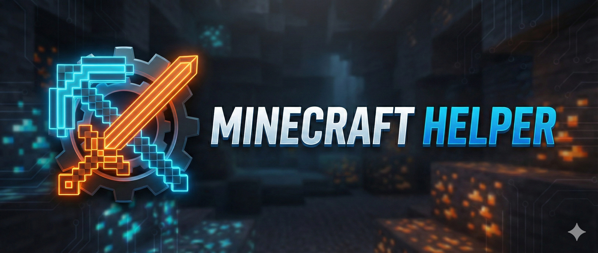
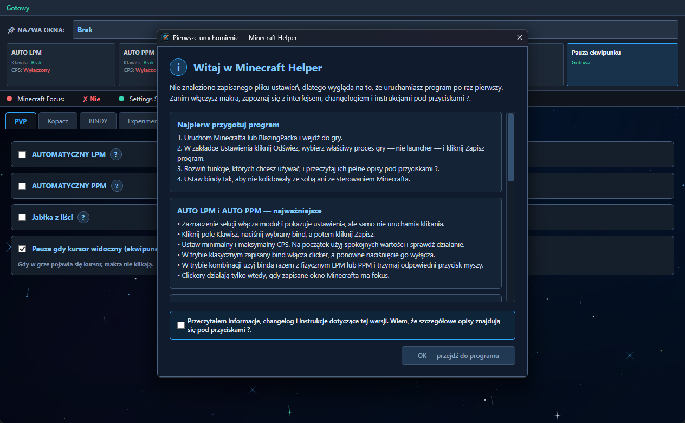
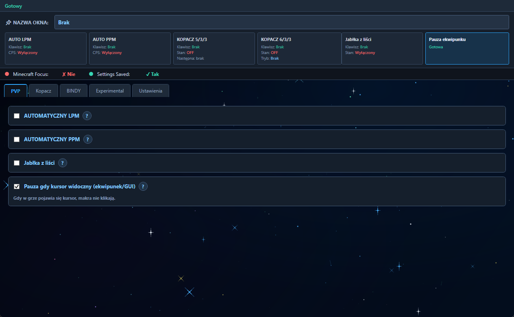
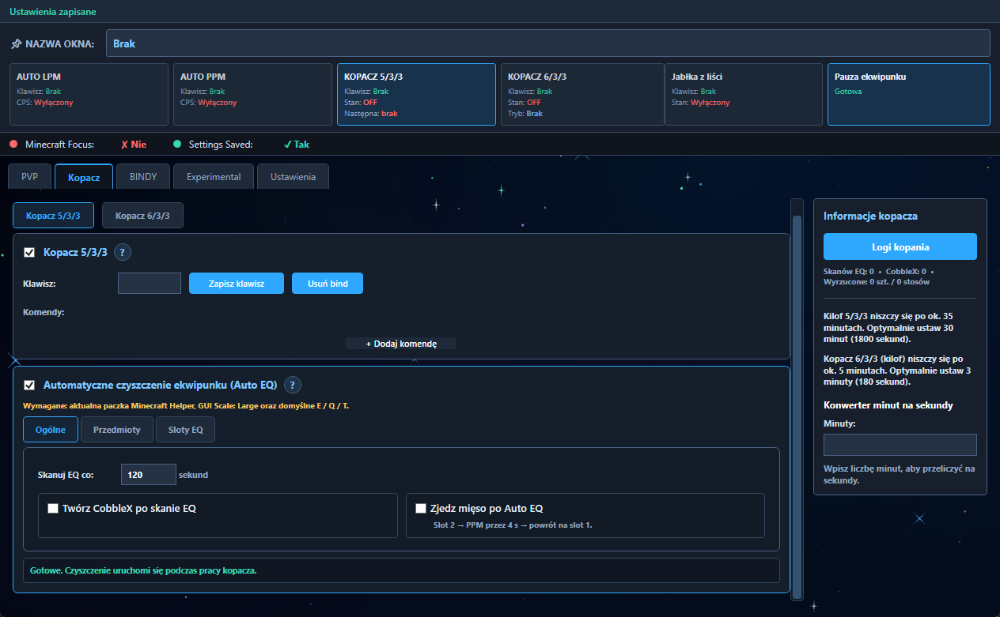
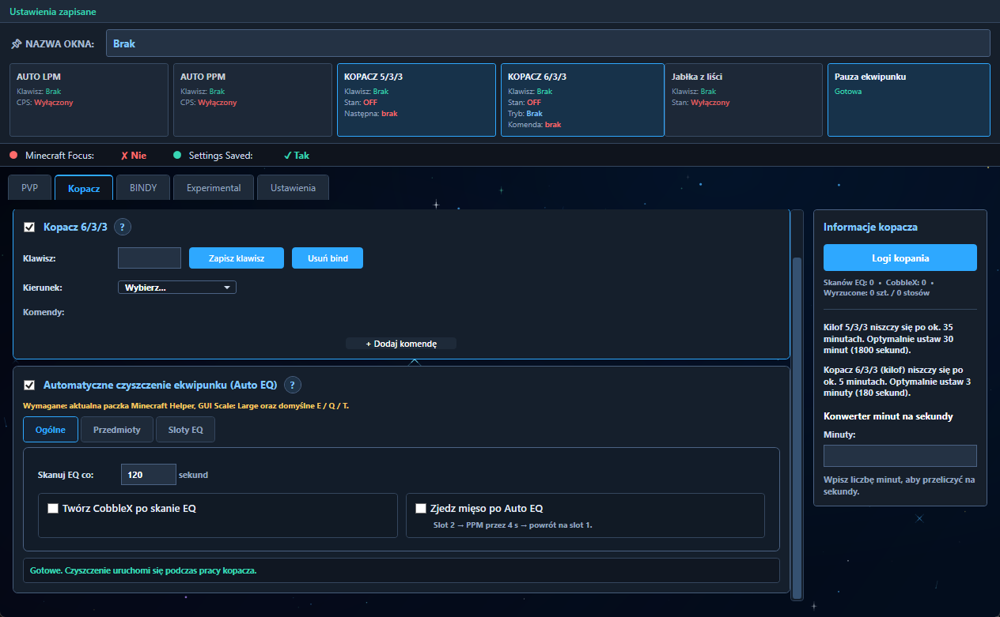
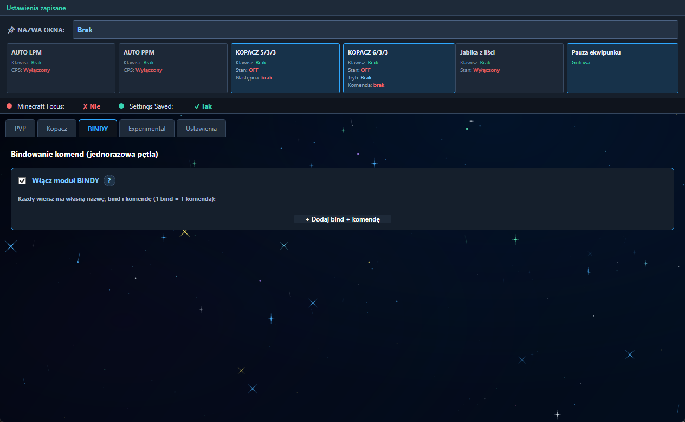
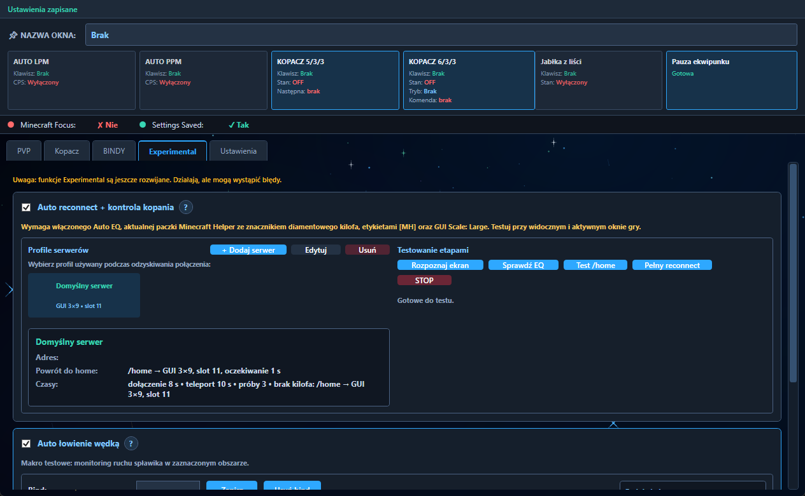
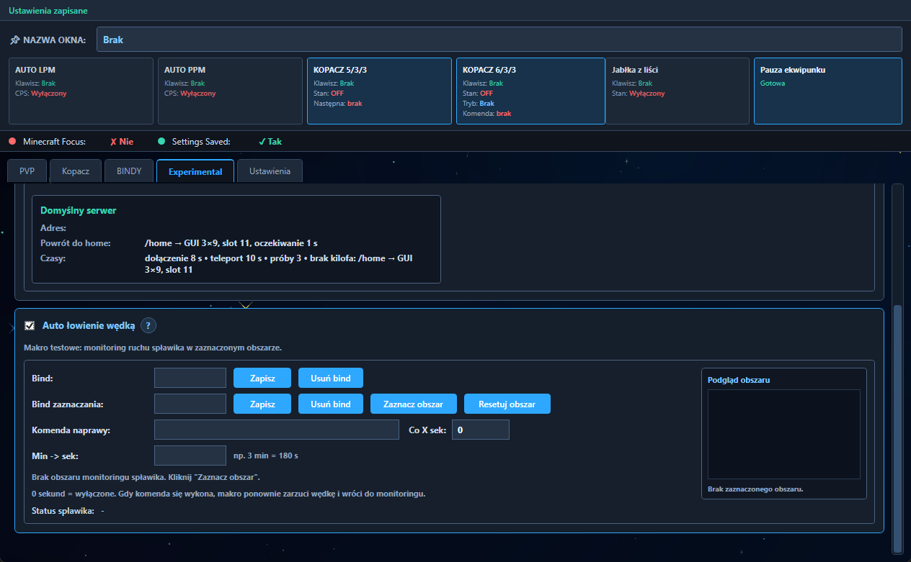
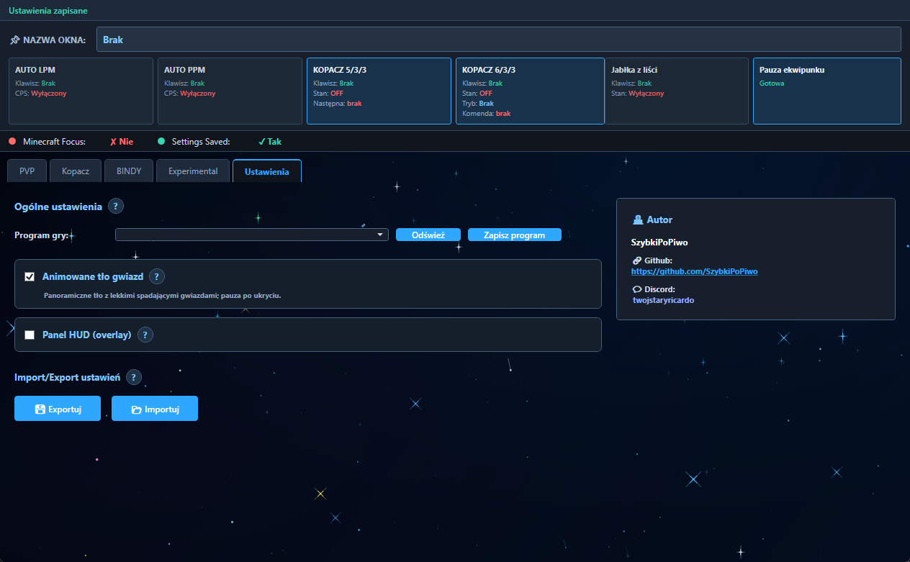

<p align="center">
  
</p>

<h1 align="center">Minecraft Helper</h1>

<p align="center">
  Clickery, automatyczne kopanie, Auto EQ, CobbleX, Auto Reconnect, logi i HUD dla Minecraft 1.8.8.
</p>

<p align="center">
  <strong>Windows 10/11</strong> · <strong>Minecraft 1.8.8</strong> · <strong>bez Forge i modów</strong> · <strong>wersja 1.1.5</strong>
</p>

<p align="center">
  <a href="#szybki-start">Szybki start</a> ·
  <a href="#pvp">PVP</a> ·
  <a href="#kopacz-auto-eq-i-cobblex">Kopacz</a> ·
  <a href="#bindy">BINDY</a> ·
  <a href="#experimental">Experimental</a> ·
  <a href="#ustawienia-i-hud">Ustawienia</a> ·
  <a href="#instalacja">Instalacja</a> ·
  <a href="#to-do">TO DO</a>
</p>

Minecraft Helper to aplikacja dla Windows wspomagająca grę w Minecraft 1.8.8. Pozwala uruchamiać clickery, automatyzować kopanie, wykonywać komendy pod własnymi bindami oraz porządkować ekwipunek przy użyciu przygotowanej paczki zasobów. Program nie wymaga Forge ani instalowania moda w grze.

> Program wysyła wejście z klawiatury i myszy do wybranego okna gry. Przed uruchomieniem funkcji upewnij się, że wskazany jest właściwy proces Minecrafta, a okno gry ma fokus.

## Szybki start

Jeżeli korzystasz z programu pierwszy raz:

1. [Zainstaluj aplikację](#instalacja) albo [uruchom ją ze źródeł](docs/BUILDING.md).
2. Uruchom Minecraft lub BlazingPack w wersji 1.8.8 i wejdź do gry.
3. W Minecraft Helper otwórz zakładkę `Ustawienia`.
4. Kliknij `Odśwież`, wybierz właściwy proces gry i kliknij `Zapisz program`. Nie wybieraj launchera.
5. Jeżeli chcesz używać Auto EQ lub Auto Reconnect, zainstaluj [paczkę zasobów Minecraft Helper](#wymagana-paczka-zasobów).
6. Otwórz interesującą Cię zakładkę, zaznacz moduł i skonfiguruj jego ustawienia.
7. Ustaw bind, zapisz ustawienia i przejdź do Minecrafta.

Zaznaczenie głównego pola modułu rozwija jego konfigurację. Samo zaznaczenie nie zawsze uruchamia funkcję — clickery, Kopacz i pozostałe moduły włącza się ustawionym bindem. Szczegółowe podpowiedzi są dostępne pod przyciskami `?`.

Przy pierwszym uruchomieniu pojawi się okno powitalne. Po aktualizacji programu to samo okno pokaże listę zmian i ostrzeże o ewentualnej różnicy wersji zapisanych ustawień.

Przy uruchomieniu program sprawdza także najnowsze publiczne wydanie na GitHubie. Jeśli dostępna jest nowsza wersja, wyświetli numer obecnej i najnowszej wersji oraz bezpieczny link do oficjalnego instalatora. Instalator nie jest pobierany ani uruchamiany automatycznie, a brak internetu nie blokuje startu programu.

<p align="center">
  <a href="docs/images/app-first-run.png">
    
  </a><br>
  <sub>Przewodnik pierwszego uruchomienia prowadzi przez podstawową konfigurację programu.</sub>
</p>

## Przegląd funkcji

| Zakładka | Do czego służy |
| --- | --- |
| `PVP` | Automatyczne klikanie LPM i PPM, obsługa bindów oraz pauza po otwarciu GUI. |
| `Kopacz` | Automatyczne kopanie, harmonogram komend, czyszczenie ekwipunku i tworzenie CobbleX. |
| `BINDY` | Własne skróty, które wpisują i wysyłają przygotowane komendy na czacie. |
| `Experimental` | Automatyczne łowienie oraz profile Auto Reconnect z powrotem do kopania. |
| `Ustawienia` | Wybór procesu Minecrafta, konfiguracja HUD, import i eksport ustawień oraz działanie aplikacji w tle. |

## PVP

<p align="center">
  <a href="docs/images/app-pvp.png">
    
  </a><br>
  <sub>Kliknij obraz, aby otworzyć go w pełnym rozmiarze.</sub>
</p>

W tej zakładce znajdują się funkcje związane z klikaniem oraz ich zabezpieczenie przed działaniem w otwartym ekwipunku.

### AUTO LPM i AUTO PPM

- `AUTO LPM` automatycznie wykonuje lewe kliknięcia.
- `AUTO PPM` automatycznie wykonuje prawe kliknięcia.
- `AUTO LPM`, `AUTO PPM` i `HOLD PPM` nie uruchomią się, gdy Minecraft pokazuje kursor ekwipunku, chatu albo innego GUI. Bind zostanie zignorowany, dzięki czemu klawisz używany podczas pisania nie zostanie przechwycony przez makro.
- Tryb pełnoekranowy jest obsługiwany: przezroczysty kursor używany przez grę nie jest mylony z kursorem otwartego GUI.
- Zakres minimalnego i maksymalnego CPS określa szybkość klikania.
- W trybie klasycznym ustawiony bind włącza clicker, a kolejne naciśnięcie go wyłącza.
- Tryb kombinacji uruchamia odpowiedni clicker podczas trzymania przypisanego bindu razem z fizycznym LPM albo PPM. AUTO LPM i AUTO PPM mogą korzystać z jednego wspólnego bindu, jeżeli każdy z nich ma włączony tryb kombinacji albo `Trzymanie bindu`. Wspólny bind jest blokowany w trybie klasycznym, aby jedno naciśnięcie nie przełączało przypadkowo obu makr.
- Opcjonalny tryb `DAB (O)` przytrzymuje klawisz `O` podczas działania AUTO LPM.

Najpierw zaznacz wybrany moduł, rozwiń ustawienia, przypisz bind i zapisz konfigurację. Clicker działa tylko wtedy, gdy zapisane okno Minecrafta ma fokus.

Podczas pracy clickera program zapisuje lekki log diagnostyczny z czasami wysyłania kliknięć, opóźnieniem obsługi myszy i przerwami pracy interfejsu. Zapis odbywa się w tle i nie wykonuje operacji dyskowych bezpośrednio w hooku myszy. Plik znajduje się w:

```text
%APPDATA%\Minecraft Helper\macro-diagnostics.log
```

Po przekroczeniu 4 MB poprzedni plik jest przenoszony do `macro-diagnostics.previous.log`. Te dane pomagają sprawdzić zgłoszenia o przycinaniu kursora bez zapisywania naciskanych klawiszy ani treści wpisywanych w grze.

### Pozostałe opcje

- `Jabłka z liści` wykonują przygotowany cykl z wybranym bindem i komendą.
- `Pauza gdy kursor widoczny (ekwipunek/GUI)` zatrzymuje klikanie, kiedy gra pokazuje kursor. Zalecamy pozostawić tę opcję włączoną.

## Kopacz, Auto EQ i CobbleX

<p align="center">
  <a href="docs/images/app-kopacz.png">
    
  </a>
  <a href="docs/images/app-kopacz-633.png">
    
  </a><br>
  <sub>Kopacz 5/3/3 i 6/3/3 — kliknij wybrany obraz, aby otworzyć go w pełnym rozmiarze.</sub>
</p>

Zakładka `Kopacz` łączy automatyczne kopanie z wykonywaniem komend oraz opcjonalnym czyszczeniem ekwipunku.

### Tryby kopania

- `Kopacz 5/3/3` — osobny kanał automatycznego kopania z bindem i listą komend wykonywanych po ustawionym czasie.
- `Kopacz 6/3/3` — osobny kanał kopania na wprost lub do góry, z konfiguracją szerokości i długości.

Kanały mają oddzielne zakładki i checkboxy konfiguracji. Kopanie uruchamia się i zatrzymuje zapisanym bindem; uruchomienie jednego kanału zatrzymuje drugi. Czasy zaplanowanych komend są liczone od rozpoczęcia cyklu, dlatego kolejne komendy powinny mieć rosnące wartości.

### Auto EQ — automatyczne czyszczenie ekwipunku

Auto EQ otwiera ekwipunek w ustalonych odstępach, rozpoznaje oznaczone przedmioty i wyrzuca całe stosy z wybranych pól przez `lewy Ctrl + ustawiony klawisz wyrzucania`.

Przed skanem program odsuwa kursor poza GUI, aby nazwa przedmiotu nie zasłoniła sąsiednich pól. Po wyrzucaniu ponownie sprawdza otwarty ekwipunek i w razie potrzeby wykonuje maksymalnie trzy przebiegi. Dzięki temu wynik obejmuje przedmioty faktycznie usunięte, a nie tylko wykonane próby naciśnięcia skrótu.

Program wyrzuca przedmioty tylko z 27 pól głównego ekwipunku. Hotbar, pancerz i crafting są zawsze pomijane przy wyrzucaniu. Kontrola bezpieczeństwa może jednak odczytać znacznik diamentowego kilofa również z hotbara. W zwykłym trybie zaznaczony typ przedmiotu oznacza „wyrzucaj”, a odznaczony „zawsze zostaw”. Opcja `Wyrzucaj wszystko z EQ` jest osobnym trybem: ignoruje wybór typów i wyrzuca każdy wykryty przedmiot z zaznaczonych slotów, pozostawiając cobblestone. Wybrane typy są zapamiętywane i wracają po wyłączeniu tego trybu. Na czas skanowania i wyrzucania pozostałe akcje Kopacza czekają.

Opcja `Zjedz mięso po Auto EQ` wykonuje dodatkowy etap po zakończeniu skanowania i ewentualnym utworzeniu CobbleX. Program zamyka ekwipunek, wybiera slot `2`, przytrzymuje PPM przez 4 sekundy, wraca na slot `1` i dopiero wtedy wznawia kopanie. Mięso musi znajdować się na drugim polu hotbara, a narzędzie do kopania na pierwszym.

#### Wymagana paczka zasobów

Rozpoznawanie przedmiotów działa z paczką:

```text
MinecraftHelper_AutoEQ_CobbleX_1.8.8.zip
```

Skopiuj plik ZIP z głównego katalogu repozytorium do poniższego folderu. Nie rozpakowuj paczki:

```text
%APPDATA%\.minecraft\resourcepacks
```

Następnie w Minecraft:

1. włącz `MinecraftHelper AutoEQ + CobbleX (1.8.8)`,
2. umieść ją nad paczką `Default`,
3. wyłącz starsze paczki Minecraft Helper, aby znaczniki się nie nakładały,
4. ustaw `GUI Scale` na `Large`.

Klawisz ekwipunku musi pozostać pod `E`. Klawisze otwierania chatu i wyrzucania przedmiotu można ustawić w zakładce **Ustawienia** (domyślnie `T` i `Q`). Lewy `Ctrl` nie może być przechwytywany przez inny skrót. Podczas skanu gra musi być widoczna, aktywna i niezasłonięta innym oknem.

#### Konfiguracja Auto EQ

1. Zaznacz `Automatyczne czyszczenie ekwipunku (Auto EQ)`.
2. Ustaw odstęp pomiędzy skanami.
3. Wybierz typy przedmiotów przeznaczone do wyrzucenia.
4. Wybierz pola głównego ekwipunku, które program ma sprawdzać.
5. Otwórz ekwipunek w grze i użyj `Test wykrywania`.
6. Sprawdź wynik testu, a następnie uruchom jeden z trybów Kopacza.

Obsługiwane oznaczenia: diament, sztabka i blok złota, sztabka i blok żelaza, emerald i blok emeraldu, obsydian, jabłko, piasek, proch, węgiel, kwarc, książka, ender perła i redstone.

### Automatyczne tworzenie CobbleX

Po włączeniu tej opcji ustaw komendę serwera — domyślnie `/cx` — oraz wymaganą liczbę pełnych stacków, domyślnie `9`.

Program liczy zwykły cobblestone z widoczną liczbą `64`. Gotowy CobbleX bez liczby 64, mossy cobblestone i wariant enchantowany nie są liczone jako materiał. Po osiągnięciu progu program kończy czyszczenie, zamyka ekwipunek, otwiera czat, wysyła komendę i wznawia kopanie.

Aktualny stan Auto EQ, licznik cobblestone i wynik ostatniego skanu mogą być pokazane w HUD.

### Logi kopania

Przycisk `Logi kopania` po prawej stronie zakładki Kopacz otwiera historię całych uruchomień Kopacza. Pierwsze uruchomienie trybu 5/3/3 albo 6/3/3 tworzy nadrzędną sesję z datą, godziną i użytym kanałem. Zatrzymanie oraz ponowne uruchomienie Kopacza rozpoczyna nową sesję.

Po rozwinięciu sesji widoczne są chronologicznie:

- kolejne automatyczne otwarcia i skany EQ,
- uruchomienie, wynik i wznowienie po Auto Reconnect,
- kontrola stanu kopania,
- wykrycie braku diamentowego kilofa i powrót do home,
- zakończenie sesji Kopacza.

Kliknięcie konkretnego wpisu EQ pokazuje tryb wyrzucania, wybrane sloty i typy, liczbę przebiegów, faktycznie wyrzucone sztuki i stosy, podział na rodzaje przedmiotów, pozostałe elementy, wykonanie komendy CobbleX oraz wynik jedzenia po czyszczeniu. Skan jest rejestrowany także wtedy, gdy nie znaleziono niczego do wyrzucenia albo operacja została przerwana.

Kolory pozwalają szybko odczytać wynik: zielony oznacza poprawne zakończenie, żółty trwającą operację lub ostrzeżenie, czerwony błąd albo przerwanie, niebieski informacje o skanie, a złoty operacje CobbleX. Wznowienie kopania po Auto Reconnect pozostaje przypisane do tej samej sesji.

Wyszukiwarka obejmuje datę, godzinę, kanał Kopacza, status, rodzaj zdarzenia, przedmioty, komendę CobbleX i treść szczegółów. Przycisk `Zapisz raport` eksportuje aktualnie widoczne — również przefiltrowane — dane do pliku CSV albo TXT. Raport zawiera identyfikatory sesji, powiązania zdarzeń i dane automatyzacji. Okno zapisu domyślnie otwiera Pulpit.

Logi są przechowywane niezależnie od ustawień aplikacji w:

```text
%APPDATA%\Minecraft Helper\mining-logs.json
```

Wpisy utworzone przez starszą wersję mechanizmu pozostają dostępne jako samodzielne rekordy i mogą zawierać tylko liczbę stosów. Program oznacza je jako stare dane zamiast przedstawiać niedokładną liczbę sztuk.

## BINDY

<p align="center">
  <a href="docs/images/app-bindy.png">
    
  </a><br>
  <sub>Kliknij obraz, aby otworzyć go w pełnym rozmiarze.</sub>
</p>

Moduł pozwala przypisać własne komendy do klawiszy. Każdy wpis może mieć osobną nazwę, bind i treść komendy. Po naciśnięciu binda program otwiera czat, wpisuje przygotowaną komendę i zatwierdza ją klawiszem `Enter`.

1. Zaznacz `Włącz moduł BINDY`.
2. Dodaj wpis, podaj jego nazwę i komendę.
3. Ustaw klawisz aktywujący.
4. Zapisz ustawienia i wróć do aktywnego okna gry.

## Experimental

<p align="center">
  <a href="docs/images/app-experimental.png">
    
  </a>
  <a href="docs/images/app-experimental-fishing.png">
    
  </a><br>
  <sub>Auto Reconnect i autołowienie — kliknij wybrany obraz, aby otworzyć go w pełnym rozmiarze.</sub>
</p>

Zakładka zawiera funkcje będące nadal w fazie testów. Mogą wymagać dokładniejszego ustawienia i nie zawsze zachowywać się identycznie na każdym kliencie.

### Auto łowienie

`Auto łowienie wędką` obserwuje zaznaczony fragment ekranu, wykrywa ruch czerwonej końcówki spławika, zwija wędkę po potwierdzonym braniu i może ponowić rzut. Najlepszy efekt daje zaznaczenie małego obszaru bezpośrednio wokół spławika.

Po włączeniu HUD panel łowienia pokazuje godzinę rozpoczęcia i czas trwania sesji, bieżący etap detekcji, położenie spławika, liczbę brań oraz czas od ostatniego złowienia.

### Auto Reconnect i powrót do kopania

`Auto reconnect + kontrola kopania` jest mechanizmem testowym uruchamianym razem z Auto EQ. Nie otwiera ekwipunku w dodatkowym interwale — sprawdzenie odbywa się podczas zaplanowanego cyklu czyszczenia. Jeżeli gra nie otworzy EQ albo program nie rozpozna jego układu po kolejnych próbach, automat analizuje ekran i rozpoczyna odzyskiwanie połączenia.

Każdy serwer ma osobny profil zawierający:

- nazwę profilu i adres `Direct Connect`,
- komendę powrotu, np. `/home kopalnia`,
- informację, czy komenda otwiera GUI,
- czas oczekiwania, rozmiar GUI oraz pole, które należy kliknąć,
- czas po dołączeniu, czas teleportacji i maksymalną liczbę prób,
- osobną konfigurację powrotu po wykryciu braku diamentowego kilofa.

Edytor GUI obsługuje od 1 do 6 rzędów i od 1 do 9 kolumn. Rzędy są dodawane od dołu, a kolumny z prawej strony. Jeżeli `/home` nie ma GUI, wpisz w profilu pełną komendę — po jej wysłaniu program przejdzie bezpośrednio do oczekiwania na teleportację.

Pełny przebieg może rozpoznać ekran śmierci, rozłączenie, przycisk `Reconnect`, listę serwerów i ekran `Direct Connect`. Następnie program wpisuje zapisany adres, zatwierdza go klawiszem `Enter`, wykonuje powrót do home, sprawdza EQ i wznawia dokładnie ten kanał Kopacza, który działał przed przerwą. Ekran bana lub nieznany stan zatrzymuje automat bez dalszego klikania.

Brak znacznika diamentowego kilofa uruchamia oddzielny przebieg: program nie wykonuje ponownego Direct Connect, tylko używa skonfigurowanej komendy home i kończy bieżące kopanie. Kontrola obejmuje 27 pól głównego EQ oraz hotbar.

Zalecana kolejność testów profilu:

1. użyj `Rozpoznaj ekran` na ekranach rozłączenia, listy serwerów i Direct Connect,
2. uruchom `Sprawdź EQ` z aktywną paczką zasobów i `GUI Scale: Large`,
3. sprawdź wybrany slot przyciskiem `Test /home`,
4. dopiero na końcu uruchom `Pełny reconnect`.

> Auto Reconnect wymaga widocznego i aktywnego okna gry. Nie zapewnia kopania w tle, gdy Minecraft jest zminimalizowany, zasłonięty albo działa na nieaktywnym pulpicie wirtualnym Windows.

## Ustawienia i HUD

<p align="center">
  <a href="docs/images/app-settings.png">
    
  </a><br>
  <sub>Kliknij obraz, aby otworzyć go w pełnym rozmiarze.</sub>
</p>

To tutaj należy rozpocząć konfigurację programu:

- `Program gry` wskazuje proces Minecrafta, do którego mają trafiać klawisze i kliknięcia.
- `Odśwież` ponownie pobiera listę uruchomionych okien.
- `Zapisz program` zapamiętuje wybrane okno gry.
- `Animowane tło gwiazd` włącza lub wyłącza lekki efekt tła w głównym oknie.
- `Panel HUD (overlay)` pokazuje stan uruchomionych funkcji na ekranie.
- HUD pozwala wybrać monitor, narożnik oraz wyłączyć animacje.
- Podczas kopania HUD aktualizuje etap pracy, godzinę startu, czas działania, bieżący skan EQ oraz łączne wyniki wyrzucania i tworzenia CobbleX.
- `Eksportuj` zapisuje kopię konfiguracji, a `Importuj` przywraca ją z pliku JSON.

Główne okno uruchamia się wyśrodkowane i w rozmiarze dostosowanym do monitorów 1080p. Program pozwala uruchomić tylko jedną kopię Minecraft Helper jednocześnie, aby dwa procesy nie nadpisywały wspólnego pliku ustawień.

Ustawienia zapisują się automatycznie w:

```text
%APPDATA%\Minecraft Helper\settings.json
```

Nie wybieraj procesu launchera. Wskaż właściwe okno Minecrafta lub używanego klienta po wejściu do gry.

### Minimalizacja i ikona w zasobniku

- Przycisk minimalizacji pozostawia aplikację widoczną na pasku zadań.
- Przycisk `X` nie kończy programu — ukrywa okno w zasobniku systemowym obok zegara i pokazuje krótkie powiadomienie.
- Dwukrotne kliknięcie ikony przywraca główne okno.
- Menu pod prawym przyciskiem myszy pozwala wybrać `Pokaż aplikację` albo `Zakończ aplikację`.
- Menu zasobnika korzysta z ciemnego motywu zgodnego z pozostałą częścią interfejsu.

Jeżeli działają makra lub Kopacz, zamknięcie okna przyciskiem `X` pozostawia aplikację uruchomioną w tle. Aby całkowicie ją wyłączyć, użyj opcji `Zakończ aplikację` z menu ikony.

## Zmiany w wersji 1.1.5

- AUTO LPM i AUTO PPM mogą korzystać z jednego wspólnego bindu, jeżeli oba działają w trybie kombinacji albo `Trzymanie bindu`.
- Dodano jasne okno konfliktu, które wyjaśnia, jak rozdzielić wspólny bind przed wyłączeniem trybu kombinacji lub trzymania.
- Poprawiono obramowania folderów, sesji, otwarć EQ i zdarzeń automatyzacji w logach kopania. Rozwinięte poziomy są teraz wyraźnie oddzielone.
- Dodano sprawdzanie najnowszego publicznego wydania przy uruchomieniu programu.
- Po wykryciu nowszej wersji aplikacja pokazuje obecną i najnowszą wersję oraz link do oficjalnego instalatora na GitHubie.
- Aktualizacja nie jest pobierana ani uruchamiana automatycznie, a brak internetu nie blokuje startu programu.

## Zmiany w wersji 1.1.4

- AUTO LPM i AUTO PPM otrzymały dodatkowy tryb `Trzymanie bindu`. Clicker działa wtedy tylko podczas fizycznego trzymania przypisanego klawisza i zatrzymuje się natychmiast po jego puszczeniu.
- Dodano ustawienia klawisza otwierania chatu i klawisza wyrzucania przedmiotu. Automatyczne komendy oraz `lewy Ctrl + klawisz wyrzucania` działają teraz z własnym układem sterowania Minecrafta.
- BINDY nie uruchamiają komend podczas pisania ani przy widocznym kursorze czatu, ekwipunku lub innego GUI Minecrafta.
- Kopacz 6/3/3 przed zaplanowanym Auto EQ i CobbleX wraca do pozycji startowej: trzyma pełne `A` przy kopaniu na wprost albo jednocześnie `A + S` przy kopaniu do góry.
- Poprawiono utrzymywanie HUD nad oknem Minecrafta na Windows 10 oraz jego automatyczne odtworzenie po zamknięciu przez system.
- Przeprowadzono audyt aplikacji: usunięto nieużywany timer i starą analizę encji F3, martwe fragmenty kodu oraz zbędne tworzenie konfiguracji serializatora podczas zapisu ustawień i logów.
- Sprawdzono zależności NuGet — brak znanych podatności, pakietów przestarzałych i dostępnych aktualizacji.

## Zmiany w wersji 1.1.3

- Dodano lekkie, animowane tło z gwiazdami oraz możliwość wyłączenia animacji w ustawieniach.
- Ujednolicono wygląd i działanie pasków przewijania w głównym oknie, konfiguracji Auto Reconnect, logach i przewodniku pierwszego uruchomienia.
- Poprawiono przewijanie ekranów z dłuższą zawartością — kółko myszy nie przeskakuje już od razu na samą górę lub dół.
- Dopracowano układ sekcji Kopacza, obramowania kart i przyciski wyboru kanału 5/3/3 oraz 6/3/3.
- Komunikaty modułu BINDY znikają automatycznie po kilku sekundach.
- Auto EQ może osobno rozpoznawać i wyrzucać bloki złota, żelaza oraz emeraldu.
- Zaktualizowano generator paczki zasobów i wykrywanie jednolitych kolorów bloków z zachowaniem ochrony cobblestone.
- Odświeżono zrzuty ekranu i opis aktualnego interfejsu.

## Zmiany w wersji 1.1.2

- Dodano konfigurowalne profile Auto Reconnect z adresem Direct Connect, komendą powrotu, opcjonalnym GUI `/home`, wyborem pola i czasami oczekiwania.
- Po odzyskaniu połączenia program wznawia ten sam tryb Kopacza 5/3/3 lub 6/3/3, który działał przed rozłączeniem.
- Dodano kontrolę obecności diamentowego kilofa wykonywaną podczas zaplanowanego Auto EQ oraz osobny sposób powrotu do home po wykryciu problemu.
- Rozbudowano Auto EQ o niezależny tryb wyrzucania całej zawartości, wybór typów i slotów oraz opcjonalne jedzenie mięsa ze slotu 2.
- Przebudowano logi kopania: jedno uruchomienie Kopacza tworzy nadrzędną sesję, a kolejne otwarcia EQ i zdarzenia automatyzacji są widoczne w rozwijanych szczegółach.
- Logi zapisują tryb wyrzucania, przedmioty, sztuki, stosy, CobbleX, jedzenie i przebieg Auto Reconnect. Eksport CSV i TXT zawiera nowe dane sesji.
- Uporządkowano sekcję Kopacza, dodano czytelne obramowania kart i zakładek, zmniejszono domyślne okno oraz wyśrodkowano je przy uruchomieniu.
- Dodano blokadę uruchomienia drugiej kopii programu.
- Poprawiono obsługę wejścia, aby otwarte GUI Minecraft Helper nie powodowało przycięć podczas gwałtownych ruchów myszy.
- Dodano lokalny log diagnostyczny clickerów z czasami wysyłania kliknięć i opóźnieniami obsługi myszy.
- AUTO LPM i AUTO PPM nie przechwytują bindów przy widocznym kursorze Minecrafta; ograniczenie nie zatrzymuje pozostałych modułów.

## Zmiany w wersji 1.1.1

- Dodano trwałe logi kopania, w których każde automatyczne otwarcie EQ tworzy osobną sesję aktualizowaną na żywo.
- Dodano rozwijane szczegóły sesji, kolorowe statusy oraz dokładny podział wyrzuconych typów na sztuki i stosy.
- Dodano wyszukiwanie po dacie, trybie, statusie i przedmiotach oraz eksport przefiltrowanego raportu do CSV lub TXT.
- Poprawiono licznik wyrzucania: program odczytuje liczebność stosów i potwierdza wynik ponownym skanem EQ.
- Dodano automatyczne odsuwanie kursora poza ekwipunek, aby tooltip nie zasłaniał przedmiotów.
- Auto EQ może wykonać do trzech przebiegów skanowania i wyrzucania.
- Okno potwierdzenia usunięcia logów korzysta teraz z ciemnego motywu aplikacji.
- Przycisk minimalizacji pozostawia aplikację na pasku zadań. Przycisk `X` ukrywa ją w zasobniku systemowym obok zegara i wyświetla powiadomienie.
- Menu ikony w zasobniku otrzymało pełny ciemny motyw, łącznie z podświetleniem, separatorem i opcją zakończenia programu.
- AUTO PPM i HOLD PPM nie uruchamiają się przy widocznym kursorze Minecrafta.
- Poprawiono harmonogram AUTO LPM, AUTO PPM i HOLD PPM, aby ustawiona wartość CPS nie spadała przez opóźnienia timera systemowego.
- Poprawiono wykrywanie kursora w trybie pełnoekranowym — makro działa podczas rozgrywki, ale nadal zatrzymuje się po otwarciu EQ, czatu lub innego GUI.
- Rozszerzono dane HUD dla kopania i automatycznego łowienia o czas sesji oraz aktualne statystyki.

## Zmiany w wersji 1.1.0

- Dodano Auto EQ z wyborem typów przedmiotów i slotów 1–27.
- Dodano wyrzucanie całych stosów przez `lewy Ctrl + Q`.
- Dodano wykrywanie pełnych stacków cobblestone i automatyczną komendę CobbleX.
- Rozszerzono HUD o stan Auto EQ, licznik cobblestone i wynik ostatniego skanu.
- Dodano paczkę zasobów `MinecraftHelper AutoEQ + CobbleX (1.8.8)`.
- Uproszczono zakładki PVP i Experimental.
- Poprawiono stabilność clickera i niekontrolowane przesunięcia kursora.
- Dodano zwijane ustawienia modułów, ujednolicone nagłówki oraz pomoc pod przyciskami `?`.
- Dodano komunikaty pierwszego uruchomienia, changelog i kontrolę zgodności zapisanych ustawień.
- Dodano samodzielny instalator Windows.

## Kontakt i zgłaszanie problemów

Jeżeli zauważysz błąd, problem z konfiguracją albo masz propozycję nowej funkcji, opisz sytuację i podaj możliwie dużo szczegółów. Pomocne są screeny, używany klient Minecrafta, ustawienia modułu i informacja, co wydarzyło się przed błędem.

- GitHub: [SzybkiPoPiwo](https://github.com/SzybkiPoPiwo)
- Discord: `twojstaryricardo`

## Instalacja

Najprościej uruchomić instalator:

```text
MinecraftHelper-Setup-1.1.5.exe
```

Instalator działa dla bieżącego użytkownika, nie wymaga osobnej instalacji .NET 8, może utworzyć skrót na pulpicie i dodaje standardowy deinstalator Windows.

Kontrola oficjalnego pliku instalatora wersji 1.1.5:

```text
SHA-256: 5afceb59474fb28755d4e1daca536f12e7901b9e616520d46e7f752143295b4d
```

### Windows SmartScreen i Smart App Control

Instalator nie ma komercyjnego podpisu cyfrowego, dlatego Windows 11 może potraktować go jako nierozpoznaną aplikację. Sam brak reputacji nie oznacza wykrycia wirusa, ale zawsze upewnij się, że plik pochodzi z tego repozytorium.

Jeżeli pojawi się standardowe okno Microsoft Defender SmartScreen:

1. kliknij `Więcej informacji`,
2. sprawdź nazwę pliku i wydawcę,
3. wybierz `Uruchom mimo to` tylko wtedy, gdy ufasz pobranemu plikowi.

Na części instalacji Windows 11 funkcja `Inteligentna kontrola aplikacji` (`Smart App Control`) całkowicie blokuje niepodpisane programy. Najbezpieczniejszym rozwiązaniem jest wtedy pobranie repozytorium, sprawdzenie kodu i [samodzielne zbudowanie aplikacji](docs/BUILDING.md).

Jeżeli świadomie zdecydujesz się wyłączyć Smart App Control, przejdź do `Zabezpieczenia Windows` → `Kontrola aplikacji i przeglądarki` → `Ustawienia Inteligentnej kontroli aplikacji`. Nie wyłączaj programu antywirusowego, zapory ani całego Microsoft Defendera. Ponowne włączenie Smart App Control może zależeć od wydania Windows i wymagać resetu lub ponownej instalacji systemu.

Aktualne informacje: [Inteligentna kontrola aplikacji — FAQ](https://support.microsoft.com/pl-pl/windows/security/threat-malware-protection/smart-app-control-frequently-asked-questions) oraz [Kontrola aplikacji i przeglądarki](https://support.microsoft.com/pl-pl/windows/security/windows-security-app-browser-control).

Jeżeli zabezpieczenia zgłaszają konkretne zagrożenie, a nie tylko brak reputacji wydawcy, przerwij instalację, przeskanuj plik i sprawdź kod źródłowy.

### Kod źródłowy i bezpieczeństwo

Repozytorium zawiera kod C#, interfejs, skrypty budowania instalatora, generator paczki zasobów oraz jej pliki. Możesz pobrać całość, samodzielnie przejrzeć kod i zbudować program lokalnie zamiast korzystać z gotowego instalatora.

## Budowanie ze źródeł

Pełna instrukcja znajduje się w [docs/BUILDING.md](docs/BUILDING.md).

Wymagane są Windows 10 lub 11, .NET 8 SDK oraz Visual Studio 2022, Rider albo Visual Studio Code. Inno Setup 6 jest potrzebny tylko do tworzenia instalatora.

```powershell
git clone https://github.com/SzybkiPoPiwo/MinecraftHelper.git
cd MinecraftHelper
dotnet restore .\MinecraftHelper\MinecraftHelper.csproj
dotnet build .\MinecraftHelper\MinecraftHelper.csproj -c Release
dotnet run --project MinecraftHelper/MinecraftHelper.csproj
```

### Budowanie instalatora

```powershell
.\scripts\build-installer.ps1 -Version 1.1.5 -Rid win-x64 -SelfContained:$true -Clean
```

Wynik zostanie zapisany w `artifacts/installer/MinecraftHelper-Setup-1.1.5.exe`.

### Odtworzenie paczki zasobów

Generator wymaga Node.js:

```powershell
node tools/build-discard-texture-pack.js
```

## TO DO

Planowane kierunki dalszego rozwoju:

- obsługa nowszych wersji Minecrafta,
- możliwość zminimalizowania Minecrafta i dalszego kopania w tle,
- zdalna obsługa własnego klienta Minecraft za pomocą telefonu,
- odczytywanie i prezentowanie informacji z czatu,
- dalsze testy i dopracowanie eksperymentalnego `auto reconnectu`.

Lista przedstawia pomysły na przyszłość i nie oznacza jeszcze konkretnego terminu ich wdrożenia.
